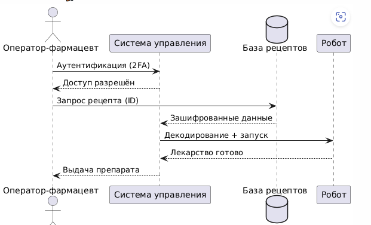
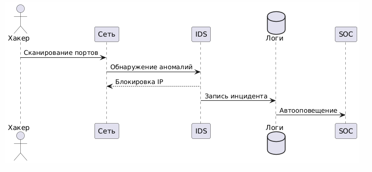
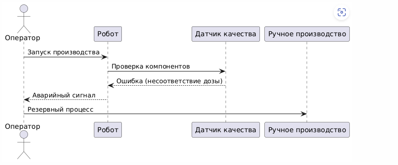

# Концепция безопасности системы "Робот-фармацевт"

## 1. Активы и риски (на основе входных данных)
| Актив               | Угроза                                    | Уязвимость               | Последствие                 |
|---------------------|-------------------------------------------|--------------------------|-----------------------------|
| **Лекарство**       | Нарушение техпроцесса                    | Ошибки в ПО/датчиках     | Вред здоровью пациентов     |
| **Рецептура**       | Утечка коммерческой тайны                | Слабая аутентификация    | Утрата конкурентного преимущества |
| **Персональные данные** | Несанкционированный доступ          | Отсутствие шифрования    | Штрафы до 5% оборота        |
| **Робот**           | Отказ оборудования                       | Износ компонентов        | Простой производства        |
| **Пациенты**        | Приём неправильного лекарства            | Человеческий фактор      | Юридические последствия     |

---

## 2. Цели безопасности
| Принцип           | Реализация                                      |
|-------------------|-------------------------------------------------|
| **Конфиденциальность** | Шифрование рецептур (AES-256 + HSM), RBAC      |
| **Целостность**       | Цифровая подпись этапов производства (ECDSA)   |
| **Доступность**       | Резервный робот + ручное производство          |

---

## 3. Сценарии функционирования
### 3.1 Нормальный процесс

## 3.2 Негативные сценарии
## 3.2.1 Утечка рецептуры

## 3.2.2 Производство брака

## 4. Архитектурная схема

