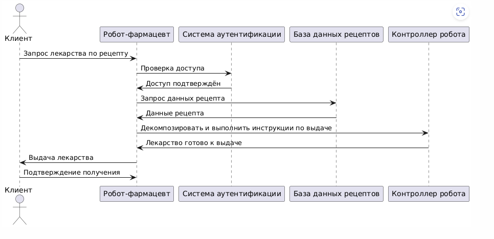
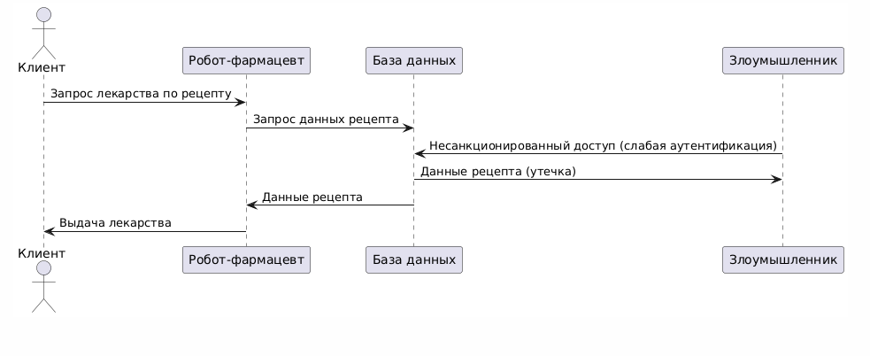
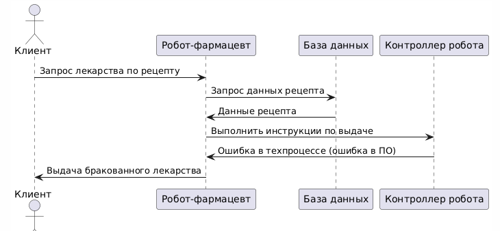
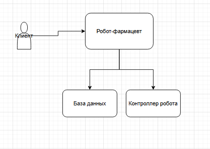
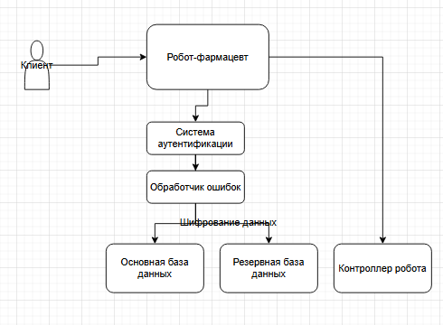

# Концепция безопасности системы "Робот-фармацевт"

## 1. Карточка описания назначения и применения продукта

- **Продукт**: Робот-фармацевт, устройство для выдачи лекарств по индивидуальному рецепту.
- **Рецепт включает в себя**: Информацию о лекарстве, дозировке и пациенте.
- **Точный состав и количество компонентов**: Лекарства, указанные в рецепте, в необходимом количестве для курса лечения.
- **Уникальный идентификатор**: Код рецепта, который привязан к конкретному пациенту и курсу лечения.

## 2. Активы и риски

| Актив               | Угроза                                    | Уязвимость               | Последствие                 |
|---------------------|-------------------------------------------|--------------------------|-----------------------------|
| **Лекарство**       | Нарушение техпроцесса                    | Ошибки в ПО/датчиках     | Вред здоровью пациентов     |
| **Рецептура**       | Утечка коммерческой тайны                | Слабая аутентификация    | Утрата конкурентного преимущества |
| **Персональные данные** | Несанкционированный доступ          | Отсутствие шифрования    | Штрафы до 5% оборота        |
| **Робот**           | Отказ оборудования                       | Износ компонентов        | Простой производства        |
| **Пациенты**        | Приём неправильного лекарства            | Человеческий фактор      | Юридические последствия     |

## 3. Цели безопасности

| Принцип           | Реализация                                      |
|-------------------|-------------------------------------------------|
| **Конфиденциальность** | Шифрование рецептур (AES-256 + HSM), RBAC      |
| **Целостность**       | Цифровая подпись этапов производства (ECDSA)   |
| **Доступность**       | Резервный робот + ручное производство          |

## 4. Предположения безопасности

- Система работает в защищённой сети, и внешние атаки ограничены.
- Персонал (администраторы) обучен и не совершает умышленных ошибок.
- Клиенты предоставляют корректные рецепты.

## 5. Сценарии функционирования

### 5.1 Нормальный процесс

#### Описание сценария функционирования
- **Клиент**: Запрашивает лекарство по рецепту.
- **Робот-фармацевт**: Проверяет доступ, подтверждает рецепт, запрашивает данные рецепта, выполняет инструкции по выдаче лекарства.
- **База данных рецептов**: Хранит данные рецептов.
- **Контроллер робота**: Управляет роботом-фармацевтом для выполнения инструкций.

### 5.2 Негативные сценарии

#### 5.2.1 Утечка рецептуры

##### Описание сценария
- **Клиент**: Запрашивает лекарство по рецепту.
- **Робот-фармацевт**: Запрашивает данные рецепта.
- **База данных**: Хранит данные рецептов.
- **Злоумышленник**: Получает несанкционированный доступ к базе данных и крадёт данные рецепта.

#### 5.2.2 Производство брака

##### Описание сценария
- **Клиент**: Запрашивает лекарство по рецепту.
- **Робот-фармацевт**: Запрашивает данные рецепта и отправляет инструкции контроллеру.
- **База данных**: Предоставляет данные рецепта.
- **Контроллер робота**: Совершает ошибку в техпроцессе, что приводит к производству бракованного лекарства.

## 6. Архитектурная схема

### Описание архитектурной схемы
- **Клиент**: Пользователь, который запрашивает лекарство через интерфейс системы.
- **Робот-фармацевт**: Устройство, которое принимает запросы, проверяет рецепты и выдаёт лекарства.
- **База данных**: Хранит информацию о рецептах и клиентах.
- **Взаимодействие**:
  - Клиент отправляет запрос роботу.
  - Робот запрашивает данные из базы.
  - После проверки рецепта робот выдаёт лекарство клиенту.

## 7. Доработанная архитектура с защитой

### Описание доработанной архитектурной схемы
Для повышения безопасности и надёжности системы были внесены следующие изменения:
- **Резервная база данных**: Добавлена для хранения копий данных на случай сбоя основной базы.
- **Обработчик ошибок**: Механизм, который автоматически повторяет запрос к базе данных в случае сбоя.
- **Шифрование данных**: Персональные данные клиента шифруются при передаче между роботом и базой данных.
- **Взаимодействие**:
  - Клиент отправляет запрос роботу.
  - Робот запрашивает данные из основной базы; если она недоступна, запрос уходит к резервной базе.
  - После проверки рецепта робот выдаёт лекарство клиенту.

## 8. Роли пользователей

- **Клиент**: Запрашивает лекарства по рецепту.
- **Администратор**: Управляет роботом и базой данных, устраняет сбои.

## 9. Итог

Проект включает анализ активов, рисков, целей безопасности, предположений безопасности, сценариев функционирования и негативных сценариев для системы "Робот-фармацевт". Архитектурная схема была доработана с учётом выявленных рисков, чтобы минимизировать сбои, защитить данные клиентов и обеспечить надёжность системы.
