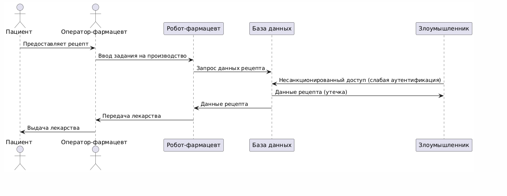
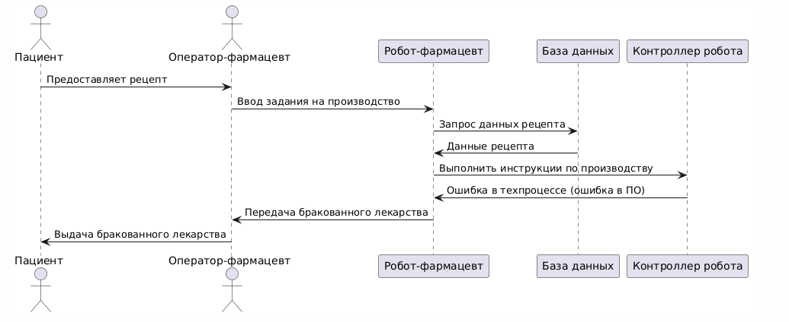
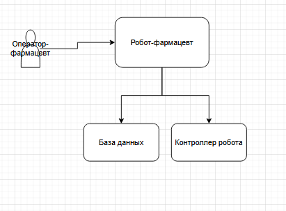
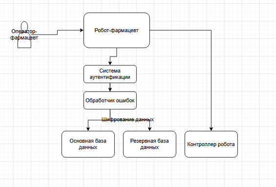

# Концепция безопасности системы "Робот-фармацевт"

## 1. Карточка описания назначения и применения продукта

- **Продукт**: Робот-фармацевт, который производит лекарство по индивидуальному рецепту.
- **Рецепт включает в себя**:
  а) Точный состав и количество компонентов, порядок и условия изготовления конечного продукта.  
  б) Уникальный идентификатор лекарства, который изготавливается в определённом объёме для индивидуального курса лечения.

## 2. Активы и риски

| Актив               | Угроза                                    | Уязвимость               | Последствие                 |
|---------------------|-------------------------------------------|--------------------------|-----------------------------|
| **Лекарство**       | Нарушение техпроцесса                    | Ошибки в ПО/датчиках     | Вред здоровью пациентов     |
| **Рецептура**       | Утечка коммерческой тайны                | Слабая аутентификация    | Утрата конкурентного преимущества |
| **Персональные данные** | Несанкционированный доступ          | Отсутствие шифрования    | Штрафы до 5% оборота        |
| **Робот**           | Отказ оборудования                       | Износ компонентов        | Простой производства        |
| **Пациенты**        | Приём неправильного лекарства            | Человеческий фактор      | Юридические последствия     |

## 3. Цели безопасности

| Принцип           | Реализация                                      |
|-------------------|-------------------------------------------------|
| **Конфиденциальность** | Шифрование рецептур (AES-256 + HSM), RBAC      |
| **Целостность**       | Цифровая подпись этапов производства (ECDSA)   |
| **Доступность**       | Резервный робот + ручное производство          |

## 4. Предположения безопасности

- Система работает в защищённой сети, и внешние атаки ограничены.
- Персонал (администраторы) обучен и не совершает умышленных ошибок.
- Пациенты предоставляют корректные рецепты.

## 5. Сценарии функционирования

### 5.1 Нормальный процесс

#### Описание сценария функционирования
- **Пациент**: Предоставляет рецепт оператору-фармацевту и получает лекарство.
- **Оператор-фармацевт**: Вводит задание на производство в робота-фармацевта и передаёт лекарство пациенту.
- **Робот-фармацевт**: Обрабатывает задание, запрашивает проверку доступа, получает данные рецепта, отправляет инструкции контроллеру.
- **Система аутентификации**: Проверяет доступ оператора.
- **База данных рецептов**: Хранит данные рецептов.
- **Контроллер робота**: Декомпозирует и выполняет инструкции по производству лекарства.

### 5.2 Негативные сценарии

#### 5.2.1 Утечка рецептуры

##### Описание сценария
- **Пациент**: Предоставляет рецепт оператору-фармацевту.
- **Оператор-фармацевт**: Вводит задание на производство и получает лекарство для пациента.
- **Робот-фармацевт**: Запрашивает данные рецепта.
- **База данных**: Хранит данные рецептов.
- **Злоумышленник**: Получает несанкционированный доступ к базе данных из-за слабой аутентификации и крадёт данные рецепта.

#### 5.2.2 Производство брака

##### Описание сценария
- **Пациент**: Предоставляет рецепт оператору-фармацевту.
- **Оператор-фармацевт**: Вводит задание на производство и получает лекарство для пациента.
- **Робот-фармацевт**: Запрашивает данные рецепта и отправляет инструкции контроллеру.
- **База данных**: Предоставляет данные рецепта.
- **Контроллер робота**: Совершает ошибку в техпроцессе из-за сбоя в ПО, что приводит к производству бракованного лекарства.

## 6. Архитектурная схема

### Описание архитектурной схемы
- **Оператор-фармацевт**: Вводит задание на производство через интерфейс системы.
- **Робот-фармацевт**: Устройство, которое принимает задание, проверяет рецепты и производит лекарства.
- **База данных**: Хранит информацию о рецептах.
- **Контроллер робота**: Управляет роботом-фармацевтом для выполнения инструкций.
- **Взаимодействие**:
  - Оператор-фармацевт вводит задание в робота.
  - Робот запрашивает данные из базы.
  - Робот отправляет инструкции контроллеру.
  - После выполнения инструкций робот передаёт лекарство оператору.

## 7. Доработанная архитектура с защитой

### Описание доработанной архитектурной схемы
Для повышения безопасности и надёжности системы были внесены следующие изменения:
- **Система аутентификации**: Добавлена для проверки доступа оператора-фармацевта.
- **Резервная база данных**: Добавлена для хранения копий данных на случай сбоя основной базы.
- **Обработчик ошибок**: Механизм, который автоматически повторяет запрос к базе данных в случае сбоя.
- **Шифрование данных**: Данные рецептов шифруются при передаче между роботом и базами данных.
- **Контроллер робота**: Управляет роботом-фармацевтом для выполнения инструкций.
- **Взаимодействие**:
  - Оператор-фармацевт вводит задание в робота.
  - Робот запрашивает проверку доступа у системы аутентификации.
  - Робот запрашивает данные из основной базы через обработчик ошибок; если она недоступна, запрос уходит к резервной базе.
  - Робот отправляет инструкции контроллеру.
  - После выполнения инструкций робот передаёт лекарство оператору.

## 8. Роли пользователей

- **Оператор-фармацевт**: Вводит задание на производство и получает лекарство для передачи клиенту.
- **Пациент**: Получает рецепт от врача в клинике и по этому рецепту получает лекарство в аптеке.

## 9. Итог

Проект включает анализ активов, рисков, целей безопасности, предположений безопасности, сценариев функционирования и негативных сценариев для системы "Робот-фармацевт". Архитектурная схема была доработана с учётом выявленных рисков, чтобы минимизировать сбои, защитить данные клиентов и обеспечить надёжность системы.
