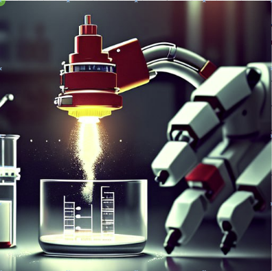
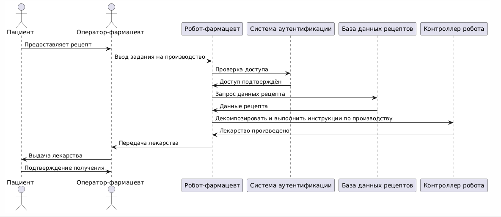
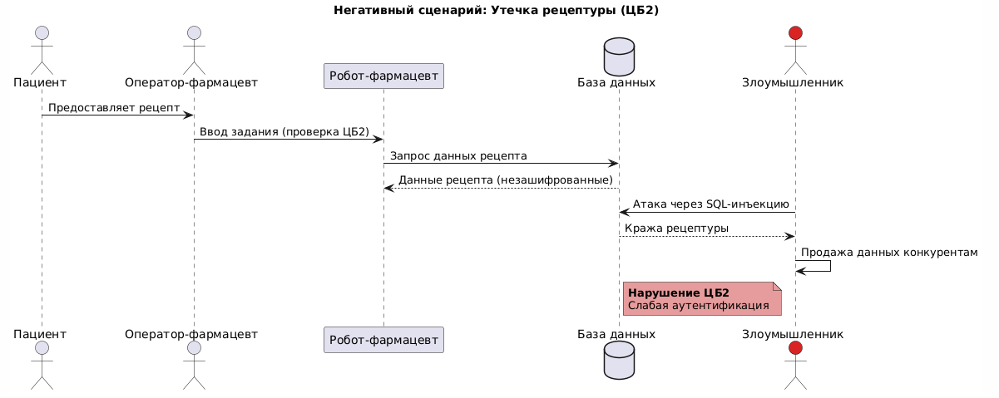
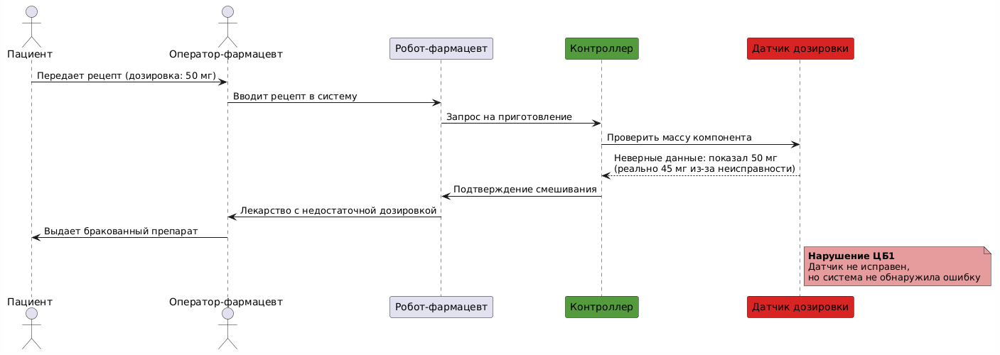
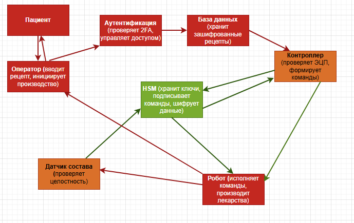

# Концепция безопасности системы "Робот-фармацевт"

## 1. Карточка описания назначения и применения продукта

- **Продукт**: Робот-фармацевт, который производит лекарство по индивидуальному рецепту.
- **Рецепт включает в себя**:
  а) Точный состав и количество компонентов, порядок и условия изготовления конечного продукта.  
  б) Уникальный идентификатор лекарства, который изготавливается в определённом объёме для индивидуального курса лечения.

## 2. Активы и риски
| Актив               | Угроза                                    | Уязвимость               | Последствие                 |
|---------------------|-------------------------------------------|--------------------------|-----------------------------|
| **Лекарство**       | Нарушение техпроцесса                    | Ошибки в ПО/датчиках     | Вред здоровью пациентов     |
| **Рецептура**       | Утечка коммерческой тайны                | Слабая аутентификация    | Утрата конкурентного преимущества |
| **Персональные данные** | Несанкционированный доступ          | Отсутствие шифрования    | Штрафы до 5% оборота        |
| **Робот**           | Отказ оборудования                       | Износ компонентов        | Простой производства        |
| **Пациенты**        | Приём неправильного лекарства            | Человеческий фактор      | Юридические последствия     |

## 3. Цели безопасности

## 3. Цели безопасности

| Цель безопасности | Реализация |
|-------------------|------------|
| **ЦБ1:** Состав производимых лекарств всегда точно соответствует рецепту (актив: корректность состава) | Цифровая подпись рецептов (ECDSA), контроль датчиками состава |
| **ЦБ2:** Рецептурные данные никогда не раскрываются неавторизованным лицам (актив: конфиденциальность данных) | Шифрование (AES-256 + HSM), двухфакторная аутентификация |

## 4. Соотнесение ценностей и целей
| Ценность               | Негативное событие                          | Оценка ущерба       | Цель безопасности |
|------------------------|---------------------------------------------|---------------------|-------------------|
| **Здоровье пациентов** | Приём бракованного лекарства                | Высокий    | ЦБ1              |
| **Коммерческая тайна** | Утечка рецептуры конкурентам               | Высокий            | ЦБ2              |

<!-- DELETE: Удалены общие предположения -->
<!-- ADD: Конкретные предположения -->
## 5. Предположения безопасности
- **Физическая безопасность**: Робот и серверы расположены в охраняемом помещении с контролем доступа.
- **Верификация рецептов**: Врачи клиники проверяют рецепты до передачи в систему.
- **Контроль персонала**: Все операторы проходят ежегодную проверку компетенций.
- **Стабильность сети**: Используется выделенный VLAN с приоритезацией трафика.

## 6. Сценарии функционирования
### 6.1 Нормальный процесс

- **Пациент** → **Оператор**: Предоставляет рецепт  
- **Оператор** → **Робот**: Вводит задание (проверка ЦБ2)  
- **Робот** → **Контроллер**: Инструкции с подписью (ЦБ1)  

### 6.2 Негативные сценарии
#### 6.2.1 Утечка рецептуры

**Нарушена цель**: ЦБ2  
**Сценарий**: Обход аутентификации → кража данных из БД.  
**Меры**: Усилить контроль доступа 

#### 6.2.2 Производство брака

**Нарушена цель**: ЦБ1  
**Сценарий**: Сбой датчика → неправильная дозировка.  
**Меры**: Внедрить дублирующие датчики.

### 7.Подсистемы

| Подсистема         | Роль в системе                                                                 |
|--------------------|--------------------------------------------------------------------------------|
| **Пациент**        | Источник требования на производство лекарства. Передаёт рецепт оператору.     |
| **Оператор**       | Вводит рецепт в систему, инициирует процесс производства.                     |
| **Аутентификация** | Проверяет двухфакторную аутентификацию оператора, управляет доступом.          |
| **База данных**    | Хранит зашифрованные рецепты и историю операций. Доступ только через HSM.     |
| **HSM**            | Хранит ключи, выполняет шифрование/подпись. Является доверенным компонентом.  |
| **Контроллер**     | Проверяет ЭЦП рецепта, формирует команды для робота. Повышает целостность.    |
| **Робот**          | Производит лекарства по командам. Недоверенный физический исполнитель.         |
| **Датчик состава** | Проверяет состав лекарства, подписывает результаты. Повышает целостность.      |

## 8. Архитектурная схема
  

| Компоненты архитектурной схемы | Уровень доверия | Оценка сложности и размера | Обоснование                                                                      |
|-------------------------------|-----------------|------------------------|---------------------------------------------------------------------------------|
| Пациент                        | Недоверенный    | MM                     | Возможна подача некорректного рецепта, что нарушает ЦБ1                         |
| Оператор-фармацевт             | Недоверенный    | MM                     | Возможны ошибки при вводе данных, что нарушает ЦБ1                              |
| HSM                            | Доверенный      | SS                     | Ключевая проверка ЭЦП и целостности данных для обеспечения ЦБ1                  |
| Контроллер                     | Доверенный, повышает целостность    | SS                     | Возможны сбои в обработке команд, что может нарушить ЦБ1                        |
| Аутентификация                 | Недоверенный    | MM                     | Уязвимость 2FA может привести к несанкционированному доступу, нарушая ЦБ2       |
| База данных рецептов           | Недоверенный    | MM                     | Уязвимость базы может привести к утечке данных, нарушая ЦБ2                     |
| Робот                          | Недоверенный    | MM                     | Возможны технические сбои робота, влияющие на производственный процесс                 |
| Датчик состава                 | Доверенный, повышает целостность    | SS                     | Сбой проверки доступности может нарушить ЦБ1                                    |

