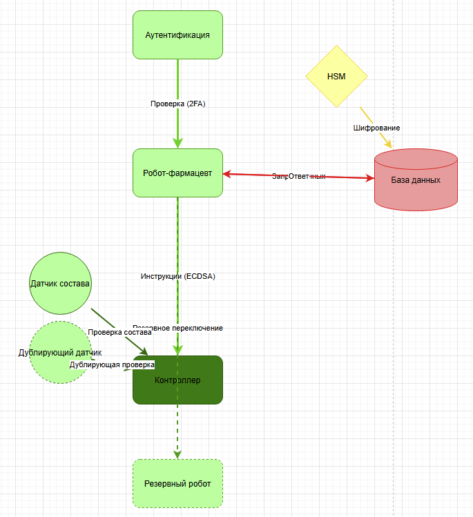

# Концепция безопасности системы "Робот-фармацевт"

## 1. Карточка описания назначения и применения продукта

- **Продукт**: Робот-фармацевт, который производит лекарство по индивидуальному рецепту.
- **Рецепт включает в себя**:
  а) Точный состав и количество компонентов, порядок и условия изготовления конечного продукта.  
  б) Уникальный идентификатор лекарства, который изготавливается в определённом объёме для индивидуального курса лечения.

## 2. Активы и риски
| Актив               | Угроза                                    | Уязвимость               | Последствие                 |
|---------------------|-------------------------------------------|--------------------------|-----------------------------|
| **Лекарство**       | Нарушение техпроцесса                    | Ошибки в ПО/датчиках     | Вред здоровью пациентов     |
| **Рецептура**       | Утечка коммерческой тайны                | Слабая аутентификация    | Утрата конкурентного преимущества |
| **Персональные данные** | Несанкционированный доступ          | Отсутствие шифрования    | Штрафы до 5% оборота        |
| **Робот**           | Отказ оборудования                       | Износ компонентов        | Простой производства        |
| **Пациенты**        | Приём неправильного лекарства            | Человеческий фактор      | Юридические последствия     |

<!-- DELETE: Удалена обобщенная таблица "Принципы безопасности" -->
<!-- ADD: Новая таблица целей безопасности -->
## 3. Цели безопасности
| Цель безопасности                                                                               | Реализация                                                                 |
|--------------------------------------------------------------------------------------------------|----------------------------------------------------------------------------|
| **ЦБ1**: Производство только лекарств с корректным составом                                     | Цифровая подпись рецептов (ECDSA), контроль датчиками состава             |
| **ЦБ2**: Недопущение утечки рецептурных данных                                                  | Шифрование (AES-256 + HSM), двухфакторная аутентификация                  |
| **ЦБ3**: Гарантированная доступность производства                                               | Резервный робот + ручной режим                                            |

<!-- ADD: Новая таблица соотнесения ценностей -->
## 4. Соотнесение ценностей и целей
| Ценность               | Негативное событие                          | Оценка ущерба       | Цель безопасности |
|------------------------|---------------------------------------------|---------------------|-------------------|
| **Здоровье пациентов** | Приём бракованного лекарства                | Катастрофический    | ЦБ1              |
| **Коммерческая тайна** | Утечка рецептуры конкурентам               | Высокий            | ЦБ2              |
| **Производство**       | Простой из-за отказа робота                 | Средний            | ЦБ3              |

<!-- DELETE: Удалены общие предположения -->
<!-- ADD: Конкретные предположения -->
## 5. Предположения безопасности
- **Физическая безопасность**: Робот и серверы расположены в охраняемом помещении с контролем доступа.
- **Верификация рецептов**: Врачи клиники проверяют рецепты до передачи в систему.
- **Контроль персонала**: Все операторы проходят ежегодную проверку компетенций.
- **Стабильность сети**: Используется выделенный VLAN с приоритезацией трафика.

## 6. Сценарии функционирования
### 6.1 Нормальный процесс

- **Пациент** → **Оператор**: Предоставляет рецепт  
- **Оператор** → **Робот**: Вводит задание (проверка ЦБ2)  
- **Робот** → **Контроллер**: Инструкции с подписью (ЦБ1)  

### 6.2 Негативные сценарии
#### 6.2.1 Утечка рецептуры

**Нарушена цель**: ЦБ2  
**Сценарий**: Обход аутентификации → кража данных из БД.  
**Меры**: Усилить контроль доступа (см. раздел 7).

#### 6.2.2 Производство брака

**Нарушена цель**: ЦБ1  
**Сценарий**: Сбой датчика → неправильная дозировка.  
**Меры**: Внедрить дублирующие датчики.

## 7. Архитектурная схема
  

| Домен               | Уровень доверия                  | Оценка | Обоснование                                                                 |
|---------------------|----------------------------------|--------|-----------------------------------------------------------------------------|
| **База данных**     | Недоверенный              | MM     | Защищена шифрованием (AES-256 + HSM), риск утечки (раздел 2)               |
| **Контроллер**      | Доверенный, целостность   | MM     | Обеспечивает ЦБ1 через ECDSA и датчики (раздел 3)                          |
| **Робот**           | Доверенный                | MM     | Основной и резервный роботы обеспечивают ЦБ3 (раздел 3)                    |
| **Аутентификация**  | Доверенный                | SS     | Реализует двухфакторную аутентификацию (ЦБ2)                               |
| **HSM**             | Доверенный                | SS     | Физически защищенное хранение ключей (раздел 3)                            |
| **Датчики**           | Доверенный | SS | Контроль состава (ЦБ1) |
| **Ручной режим**      | Доверенный | SS | Обеспечивает ЦБ3 при отказах |

## 9. Роли пользователей
- **Оператор-фармацевт**: Только ввод данных (верификация по ЦБ2).  
- **Техник**: Обслуживание робота (контроль по ЦБ3).  

